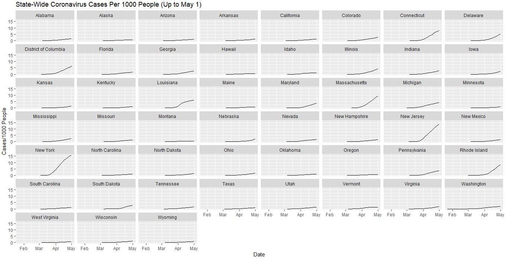
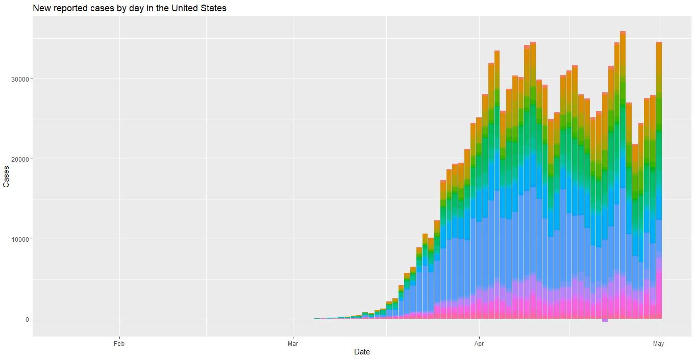
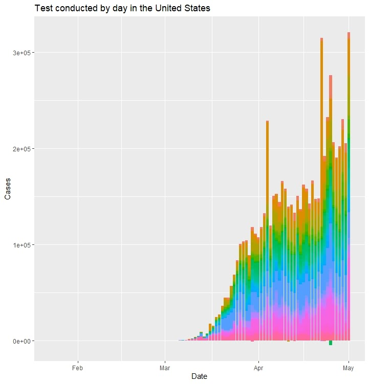
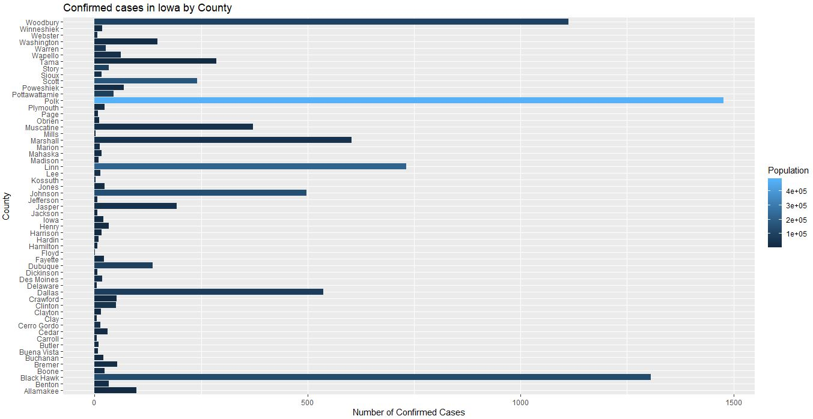
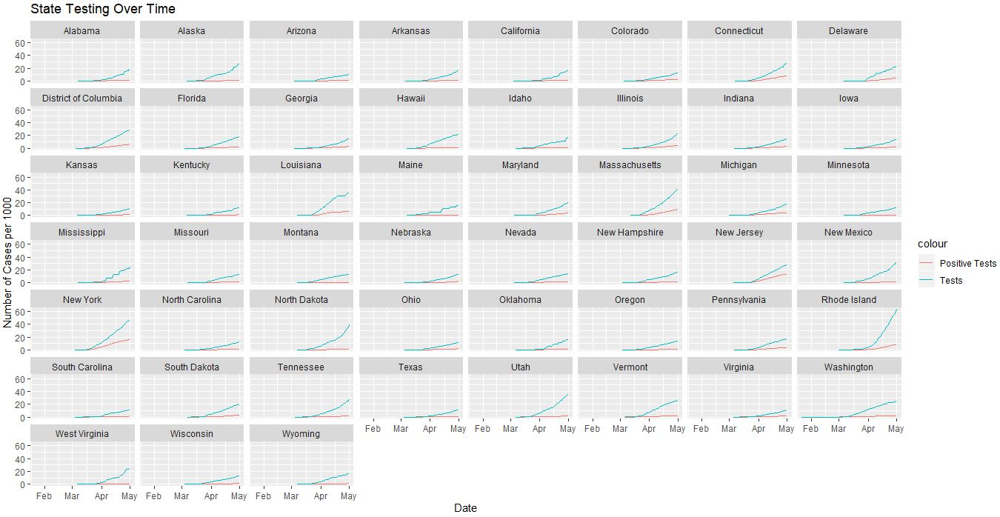

```{r setup, include=FALSE}
knitr::opts_chunk$set(echo = TRUE)
```

#### Authors: John Nownes, Sonia Thomas, Yi Hang Khor, Kobe Pranivong

#### Project Coordinator: John Nownes

## Raw Dataset
https://www.kaggle.com/sudalairajkumar/covid19-in-usa#us_states_covid19_daily.csv

## Supplementary Data Sources:
#### Population Data:
https://www.census.gov/data/datasets/time-series/demo/popest/2010s-state-total.html
<br>
https://www.iowa-demographics.com/counties_by_population

#### Social distancing Data:
https://www.kff.org/health-costs/issue-brief/state-data-and-policy-actions-to-address-coronavirus/
https://www.littler.com/publication-press/publication/stay-top-stay-home-list-statewide

#### COVID-19 in Iowa Data:
https://coronavirus.iowa.gov/pages/access 

## Abstract
The dataset we chose for our project looks at the newly-discovered novel coronavirus, which causes coronavirus disease, COVID-19. With nearly all parts of life here in the US and most places around the globe having been affected by the pandemic, it is already easily the most disruptive disease since the Spanish Flu of 1918. On top of the dangerously high number of deaths currently being predicted, the social distancing procedures being implemented to slow the spread of coronavirus appear to be pointing the economy towards a serious economic recession the effects of which may still be felt years from now. Until a vaccine is widely available, it appears that this coronavirus pandemic will be the most important factor affecting the livelihood of nearly every person in this country for several months, and for this reason it is a worthwhile project to study.

## Summary Infographic
```{r, echo=FALSE, warning=FALSE, message=FALSE}
library(lubridate)
library(dplyr)
library(ggplot2)

dat = read.csv("us_states_covid19_daily.csv", stringsAsFactors = FALSE)
dat$date = ymd(dat$date)
names(dat)[2] = "state_abbrev"
dat$state_abbrev = as.factor(dat$state_abbrev)
dat$fips = as.factor(dat$fips)
dat = dat %>%
  filter(fips != '60' & fips != '66' & fips != '69' & fips != '72' & fips != '78')
dat$fips = factor(dat$fips, levels= dat$fips, labels=dat$fips)

dist = (read.csv("social_distancing.csv", header=F)[-c(1:4,56:66),])
dist_headers = read.csv("social_distancing.csv", header = F,stringsAsFactors = F)[c(3),]
colnames(dist) =c(dist_headers[1,])
names(dist)[1] = "state"
dist$state = factor(dist$state,levels= dist$state,labels = dist$state)

pop = read.csv("state_population.csv", header = F)[-c(1:9,61:67),]
pop_headers = read.csv("state_population.csv", header = F,stringsAsFactors = F)[c(4),]
colnames(pop) = c(pop_headers[1,])
names(pop)[1] = "state"
pop$state = sub('.', '', pop$state)
pop$state = as.factor(pop$state)
pop$`2019` = as.numeric(gsub(",", "", pop$`2019`))
pop$`2019` = as.numeric(pop$`2019`)

Fips = read.csv("fips.csv", header=F, stringsAsFactors = F)[-c(1:5),]
Fips_headers = read.csv("fips.csv",header=F,stringsAsFactors = F)[c(5),]
colnames(Fips) = c(Fips_headers[1,])
Fips = Fips %>%
  filter(`Summary Level` == '040') %>%
  select(`State Code (FIPS)`, state = `Area Name (including legal/statistical area description)`) %>%
  filter(state != 'Puerto Rico')
names(Fips)[1] = "fips"
Fips$fips = gsub("^0","",Fips$fips)
Fips$fips = as.factor(Fips$fips)
Fips$state = factor(Fips$state, levels = Fips$state, labels = Fips$state)


dist = pop %>%
  select("state","2019") %>%
  inner_join(dist, by = "state")
names(dist)[2] = "population"
dist$state = as.factor(dist$state)

dist = Fips %>%
  inner_join(dist, by = "state")

dat = dat %>%
  inner_join(dist, by = "fips")
dat$fips = as.factor(dat$fips)


# https://www.littler.com/publication-press/publication/stay-top-stay-home-list-statewide
# Hard coding in the dates that the stay at home orders were enacted
states = c("Alabama", "Alaska", "Arizona", "California", "Colorado", "Connecticut", "Delaware", "District of Columbia", "Florida", "Georgia", "Hawaii", "Idaho", "Illinois", "Indiana", "Kansas", "Kentucky", "Louisiana", "Maine", "Maryland", "Massachusetts", "Michigan", "Minnesota", "Mississippi", "Missouri", "Montana", "Nevada", "New Hampshire", "New Jersey", "New Mexico", "New York", "North Carolina", "Ohio", "Oklahoma", "Oregon", "Pennsylvania", "Rhode Island", "South Carolina", "Tennessee", "Texas", "Vermont", "Virginia", "Washington", "West Virginia", "Wisconsin")
dates = c("April 4, 2020", "March 28, 2020", "March 31, 2020", "March 19, 2020", "March 26, 2020", "March 23, 2020", "March 24, 2020", "April 1, 2020", "April 3, 2020", "April 3, 2020", "March 25, 2020", "March 25, 2020", "March 21, 2020", "March 24, 2020", "March 30, 2020", "March 26, 2020", "March 23, 2020", "April 2, 2020", "March 30, 2020", "March 24, 2020", "March 24, 2020", "March 27, 2020", "April 3, 2020", "April 6, 2020", "March 28, 2020", "April 1, 2020", "March 27, 2020", "March 21, 2020", "March 23, 2020", "March 22, 2020", "March 30, 2020", "March 23, 2020", "March 24, 2020", "March 23, 2020", "April 1, 2020", "March 28, 2020", "April 7, 2020", "March 31, 2020", "April 2, 2020", "March 25, 2020", "March 30, 2020", "March 23, 2020", "March 24, 2020", "March 25, 2020")
stay_at_home = data.frame("state" = states, "stay_at_home_date" = dates)
stay_at_home$stay_at_home_date = mdy(stay_at_home$stay_at_home_date)

dat = dat %>%
  left_join(stay_at_home, by = "state")

plot_dat = dat %>%
  filter(date == '2020-04-28' | date == '2020-05-01') %>%
  group_by(state_abbrev) %>%
  mutate(increase_cases_last_3_days = diff(-positive),
         increase_tests_last_3_days = diff(-totalTestResults)) %>%
  filter(date == '2020-05-01')

plot_dat$`cases_3_days_ago` = plot_dat$positive - plot_dat$increase_cases_last_3_days
plot_dat$`tests_3_days_ago` = plot_dat$totalTestResults - plot_dat$increase_tests_last_3_days

plot_dat$cases_percent_increase = ((plot_dat$positive - plot_dat$`cases_3_days_ago`)/(plot_dat$`cases_3_days_ago`))*100
plot_dat$tests_percent_increase = ((plot_dat$totalTestResults - plot_dat$`tests_3_days_ago`)/(plot_dat$`tests_3_days_ago`))*100

plot_dat$positive_test_percent_last_3_days = (plot_dat$increase_cases_last_3_days)/(plot_dat$increase_tests_last_3_days)*100


plot_dat$`Stay at Home Order` = as.character(plot_dat$`Stay at Home Order`)
plot_dat$`Stay at Home Order`[plot_dat$`Stay at Home Order` == '-'] = "Never Enacted"
plot_dat$`Stay at Home Order` = factor(plot_dat$`Stay at Home Order`,levels = c("Never Enacted","Lifted","Rolled Back to High Risk Groups","High-Risk Groups","Statewide"))

plot_dat$`State Is Easing Social Distancing Measures` = as.character(plot_dat$`State Is Easing Social Distancing Measures`)
plot_dat$`State Is Easing Social Distancing Measures`[plot_dat$`State Is Easing Social Distancing Measures` == "-"] = "No"
plot_dat$`State Is Easing Social Distancing Measures` = factor(plot_dat$`State Is Easing Social Distancing Measures`, levels = c("No", "Yes"))


library(plotly)
g <- list(
  scope = 'usa',
  projection = list(type = 'albers usa'),
  showlakes = TRUE,
  lakecolor = toRGB('white')
)

plot_dat$hover = plot_dat %>%
  with(paste(state,
             
             "\n\nTotal cases by May 1:", round((positive/population)*1000,digits = 2), "cases per 1000 people",
             "\nTotal cases by April 28:", round((`cases_3_days_ago`/population)*1000,digits = 2), "cases per 1000 people",
             "\nPercentage increase in cases from 4/28-5/1:", sprintf("%.2f%%", cases_percent_increase),
             
             "\n\nTotal tests by May 1:", round((totalTestResults/population)*1000,digits = 2), "tests per 1000 people",
             "\nTotal tests by April 28:", round((`tests_3_days_ago`/population)*1000,digits = 2), "tests per 1000 people",
             "\nPercentage increase in tests from 4/28-5/1:",sprintf("%.2f%%",tests_percent_increase),
             
             "\n\nPercentage of positive tests from 4/28-5/1:", sprintf("%.2f%%",positive_test_percent_last_3_days),
             
             "\n\nStay at Home Order Status:", `Stay at Home Order`,
             "\nDate order enacted:", format(stay_at_home_date, format = "%B %d"),
             "\nEasing Social Restrictions:", `State Is Easing Social Distancing Measures`
  ))

library(RColorBrewer)
nfactor_orders = 5
orders <- brewer.pal(n = nfactor_orders,name = "Greys")
names(orders) = levels(plot_dat$`Stay at Home Order`)
plot_dat$test_color_orders = as.numeric(plot_dat$`Stay at Home Order`)
Z_Breaks = function(n){
  CUTS = seq(0,1,length.out=n+1)
  rep(CUTS,ifelse(CUTS %in% 0:1,1,2))
}

colorScale_orders = data.frame(z=Z_Breaks(nfactor_orders),
                         col=rep(orders,each=2),stringsAsFactors=FALSE)

nfactor_easing = 2
easing <- gray.colors(nfactor_easing, start = 0, end = 1)
names(easing) = levels(plot_dat$`State Is Easing Social Distancing Measures`)
plot_dat$test_color_easing = as.numeric(plot_dat$`State Is Easing Social Distancing Measures`)
Z_Breaks = function(n){
  CUTS = seq(0,1,length.out=n+1)
  rep(CUTS,ifelse(CUTS %in% 0:1,1,2))
}

colorScale_easing = data.frame(z=Z_Breaks(nfactor_easing),
                               col=rep(easing,each=2),stringsAsFactors=FALSE)

fig = plot_dat %>%
  plot_geo(locationmode = 'USA-states') %>%
  
  add_trace(
  type = "choropleth",
  visible = TRUE,
  name = "Cases/1000",
  z = ~(positive/population)*1000,
  text = ~hover,
  locations = ~state_abbrev,
  color = ~(positive/population)*1000,
  colorscale = 'Reds',
  hoverinfo = "text",
  colorbar = list(title = "Cases Per 1000 People", y = 0.7, len = .4)
) %>%
  
  add_trace(
  type = "choropleth",
  visible = FALSE,
  name = "Percentage Increase in Cases",
  z = ~cases_percent_increase,
  text = ~hover,
  locations = ~state_abbrev,
  color = ~cases_percent_increase,
  colorscale = 'Reds',
  hoverinfo = "text",
  colorbar = list(title = "Percentage Increase\nin Cases From 4/28-5/1", y = 0.7, len = .4)
) %>%
  
  add_trace(
    type = "choropleth",
    visible = FALSE,
    name = "Tests/1000",
    z = ~(totalTestResults/population)*1000,
    text = ~hover,
    locations = ~state_abbrev,
    color = ~(totalTestResults/population)*1000,
    colorscale = 'Greens',
    reversescale = TRUE,
    hoverinfo = "text",
    colorbar = list(title = "Tests Per 1000 People", y = .7, len = .4)
  ) %>%  
  
  add_trace(
    type = "choropleth",
    visible = FALSE,
    name = "Tests/1000 Percentage Increase",
    z = ~tests_percent_increase,
    text = ~hover,
    locations = ~state_abbrev,
    color = ~tests_percent_increase,
    colorscale = 'Greens',
    reversescale = TRUE,
    hoverinfo = "text",
    colorbar = list(title = "Percentage Increase\nin Tests From 4/28-5/1", y = .7, len = .4)
  ) %>%
  
  add_trace(
    type = "choropleth",
    visible = FALSE,
    name = "Positive Test Percentage",
    z = ~positive_test_percent_last_3_days,
    text = ~hover,
    locations = ~state_abbrev,
    color = ~positive_test_percent_last_3_days,
    colorscale = 'Reds',
    hoverinfo = "text",
    colorbar = list(title = "Percentage of Tests\nReturning Positive\nFrom 4/28-5/1", y = .7, len = .4)
  ) %>%
  
  add_trace(
    type = "choropleth",
    visible = FALSE,
    name = "Stay at Home Orders",
    locations = ~state_abbrev,
    text = ~hover,
    hoverinfo = "text",
    z = plot_dat$test_color_orders,
    colorscale=colorScale_orders,
    colorbar=list(title = "Stay at Home Order Status", tickvals=c(1.4,2.2,3,3.8,4.6), ticktext=names(orders), y = .7, len = .4)
  ) %>%
  
  add_trace(
    type = "choropleth",
    visible = FALSE,
    name = "Easing Social Restrictions",
    locations = ~state_abbrev,
    text = ~hover,
    hoverinfo = "text",
    z = plot_dat$test_color_easing,
    colorscale=colorScale_easing,
    colorbar=list(title = "Is the State Easing\nSocial Restrictions?", tickvals=c(1.25,1.75), ticktext=names(easing), y = .7, len = .4)
  ) %>%
  
  
  layout(
  geo = g,
  updatemenus = list(
    list(
      y = 0.8,
      buttons = list(
        list(
          method = "update",
          args = list(list(visible = c(TRUE,FALSE,FALSE,FALSE,FALSE,FALSE,FALSE)),
                      list(title = "Total Cases/1000 People by May 1")),
          label = "Total Cases/1000"
        ),
        
        list(
          method = "update",
          args = list(list(visible = c(FALSE,TRUE,FALSE,FALSE,FALSE,FALSE,FALSE)),
                      list(title = "Percentage Increase in Cases From April 28-May 1")),
          label = "Percentage Increase in Cases"),
        
        list(
          method = "update",
          args = list(list(visible = c(FALSE,FALSE,TRUE,FALSE,FALSE,FALSE,FALSE)),
                      list(title = "Total Tests/1000 People by May 1")),
          label = "Total Tests/1000"),  
        
        list(
            method = "update",
            args = list(list(visible = c(FALSE,FALSE,FALSE,TRUE,FALSE,FALSE,FALSE)),
                        list(title = "Percentage Increase in Tests")),
            label = "Percentage Increase in Tests"),
        
        list(
          method = "update",
          args = list(list(visible = c(FALSE,FALSE,FALSE,FALSE,TRUE,FALSE,FALSE)),
                      list(title = "Percentage of Testing Returning Positive From April 28-May 1")),
          label = "Positive Testing Percentage"),
        
        list(
          method = "update",
          args = list(list(visible = c(FALSE,FALSE,FALSE,FALSE,FALSE,TRUE,FALSE)),
                      list(title = "Stay at Home Order Status")),
          label = "Stay at Home Order Status"),
        
        list(
          method = "update",
          args = list(list(visible = c(FALSE,FALSE,FALSE,FALSE,FALSE,FALSE,TRUE)),
                      list(title = "States that are Easing\nSocial Restrictions")),
          label = "Easing Social Restrictions?")
      )
    )
  )
)
fig
```
<center>

Figure 1: Featured infographic

</center>
The above interactive graphic is our featured infographic that displays the data we explored. Please use the drop down menu on the right to explore different mappings. Some conclusions on this infographic can be found under the **Conclusion** section.

## Description of Background and Questions Raised
The author of the dataset is Sudalai Rajkumar, a popular and highly-rated contributor on Kaggle. Below is his LinkedIn, which displays some of his most impressive accomplishments. From a credibility standpoint, we are reasonably confident that Mr. Rajkumar’s data on the coronavirus is among the most accurate and thorough datasets available to the public. In addition, by checking that some of the cases and testing numbers from his dataset matched the numbers reported by the CDC further illustrated the accuracy of Mr. Rajkumar’s dataset.

https://www.linkedin.com/in/sudalairajkumar/?originalSubdomain=in

Within Mr. Rajkumar’s coronavirus Kaggle page, there are two different .csv files updated daily. One is a file containing coronavirus statistics on the US national level, and the other file contains coronavirus statistics at the US state level. We will be studying the latter file, the .csv file concerning the state-level statistics. We chose the state-level dataset because of our desire to look more closely at the individual states, especially since this pandemic varies widely by location. We also know that there has been a range of different policies put in place at the state level, and we hope to show a summary of the coronavirus situation on a per state level together with the social distancing efforts in that state.

Looking now specifically at our raw state-level .csv file, we see immediately that the dataset is arranged in a “tidy” format, since each observation includes the date of the observation and the state, making these the two keys for that row. As you move along the columns, there are statistics on tests performed cumulatively and on that day, as well as the number of each result (positive, negative, and pending). Additionally, we can see the number of deaths, hospitalizations, recoveries, and ventilators being used.

Finally, this state-level dataset is updated daily, meaning that everyday Mr. Rajkumar adds a little over 50 rows (US states and US territories) that shows the total coronavirus statistics in that state cumulatively up to that point. It is important to note that in general, there is not an accurate method to count the number of recovered patients, so the cumulative statistics offer the best method to gauge the severity of the coronavirus in each state, even though a significant number of the reported cases have recovered by that date.

#### Questions Raised
Some questions that we set out to explore in the analysis include the following:

* What is the trend of the overall dataset? Is it increasing or decreasing? Speeding up or slowing down?
* Where are the most reported cases? Least reported cases? (Specifically within each U.S state)
* How has Iowa been affected by the virus over time? Has there been a gradual increase, what does it look like?
* What is the increase in the amount of people tested in each state over time?
* What can the percentage of positive testing results tell us about the current testing capacity of each state?
* Which state is likely to have the most/least confirmed cases in 2 weeks time depending on the current growth rate?
* Which state has done the greatest/worst job in preventing the spreading of coronavirus?

## Obtaining and Cleaning the Dataset
Once we downloaded our raw dataset from kaggle, we noticed that it did not include population statistics for each state, which is important in order to compare states with different populations. Because of this, we included supplementary data from US census numbers from 2019 and joined this dataset with our raw dataset. In addition, to produce the final two categorical mappings shown in our infographic, we added more supplementary data that included the status of each state’s stay at home order (as of April 30) as well as data that showed the dates in which these orders were enacted.

Cleaning all of this data together required careful joining actions within R and special attention to the data types in these columns. The full breakdown showing how we cleaned this data is shown in approximately the first 65 lines of the Nownes.R file.


## Exploratory Analysis
<center>



</center>
We began our exploratory analysis by creating the above figure, showing the number of cases per 1000 people in each state. We see immediately that New York and its surrounding states have the most severe outbreaks of coronavirus at this time.

<center>



</center>
The exploratory analysis of our dataset is unique in the sense that we wanted to hit many different aspects in exploring the data. Our first task we wanted to tackle after cleaning the dataset was looking at the trend of the overall dataset. By using ggplot we then were able to produce a bar graph that allowed us to see the new reported cases by day in the United States over time (Figure 3). The U.S has been reporting cases since January 22nd and so when looking at the graph you can see that there is an extremely low growth rate for the first two months. Then around the middle of March you can see a significant jump in the data as cases increase. But occasionally after the month of April you do see the cases subtly fluctuate. Overall we were able to conclude that cases seem to rapidly increase by day and that really as of right now there seems to be no sign of a long term decrease.

<center>



</center>

Next, we wanted to look at how the number of tests conducted has affected this overall trend. Again by using ggplot we were able to produce the above bar graph that portrayed the number of tests conducted by day in the United States (Figure 4). Viewing both of these two graphs we can conclude that the number of new reported cases by day increases with the number of tests taken by day. It is clear to see a similar trend in both of these graphs as we see increase in each of them day by day. One thing we did want to mention after doing this part of exploring the overall dataset is that we couldn’t fully reflect a real trend of the coronavirus in the US due to the fact that there are mostly likely individuals who have the virus but of course were not tested. Also this could possibly answer why there is no data from the first two months and allowing us to consider that the pandemic might have started earlier than March.

```{R, echo= FALSE, warning =FALSE, message= FALSE}
dat2 = read.csv("us_states_covid19_daily.csv", stringsAsFactors = FALSE)
dat2$date = ymd(dat2$date)
names(dat2)[2] = "state_abbrev"
dat2$state_abbrev = as.factor(dat2$state_abbrev)
dat2$fips = as.factor(dat2$fips)
dat2 = dat2 %>%
  filter(fips != '60' & fips != '66' & fips != '69' & fips != '72' & fips != '78')
dat2$fips = factor(dat2$fips, levels= dat2$fips, labels=dat2$fips)

dist = (read.csv("social_distancing.csv", header=F)[-c(1:4,56:66),])
dist_headers = read.csv("social_distancing.csv", header = F,stringsAsFactors = F)[c(3),]
colnames(dist) =c(dist_headers[1,])
names(dist)[1] = "state"
dist$state = factor(dist$state,levels= dist$state,labels = dist$state)

pop = read.csv("state_population.csv", header = F)[-c(1:9,61:67),]
pop_headers = read.csv("state_population.csv", header = F,stringsAsFactors = F)[c(4),]
colnames(pop) = c(pop_headers[1,])
names(pop)[1] = "state"
pop$state = sub('.', '', pop$state)
pop$state = as.factor(pop$state)
pop$`2019` = as.numeric(gsub(",", "", pop$`2019`))
pop$`2019` = as.numeric(pop$`2019`)

Fips = read.csv("fips.csv", header=F, stringsAsFactors = F)[-c(1:5),]
Fips_headers = read.csv("fips.csv",header=F,stringsAsFactors = F)[c(5),]
colnames(Fips) = c(Fips_headers[1,])
Fips = Fips %>%
  filter(`Summary Level` == '040') %>%
  select(`State Code (FIPS)`, state = `Area Name (including legal/statistical area description)`) %>%
  filter(state != 'Puerto Rico')
names(Fips)[1] = "fips"
Fips$fips = gsub("^0","",Fips$fips)
Fips$fips = as.factor(Fips$fips)
Fips$state = factor(Fips$state, levels = Fips$state, labels = Fips$state)


dist = pop %>%
  select("state","2019") %>%
  inner_join(dist, by = "state")
names(dist)[2] = "population"
dist$state = as.factor(dist$state)

dist = Fips %>%
  inner_join(dist, by = "state")

dat2 = dat2 %>%
  inner_join(dist, by = "fips")
dat2$fips = as.factor(dat2$fips)

# What is the increase in the amount of people tested in each state over time?
plot <- ggplot(dat2, aes(x = date)) + geom_line(aes(y = totalTestResults, color = state_abbrev)) + ggtitle("State Testing Overtime") + ylab('Number of Tests') + xlab('Date') 
plot
```
<center>

Figure 5: Testing Over Time

</center>

```{r, echo= FALSE, warning =FALSE, message= FALSE}
# Which state is likely to have the most/least confirmed cases in 2 weeks time depending on the current growth rate?
# Most confirmed cases in 2 weeks
newYork <- dat2 %>%
  select(date, state_abbrev, positive, death, totalTestResults) %>%
  filter(state_abbrev == 'NY')

newYork[is.na(newYork)] = 0

newYorkTrend <- plot_ly(newYork, x = ~date, y = ~totalTestResults, type = 'scatter', mode = 'lines+markers', name = 'Tests Given')

newYorkTrend <- newYorkTrend %>%
  add_trace(y = ~positive, type = 'scatter', mode = 'lines+markers', name = 'Positive') %>%
  add_trace(y= ~death, type = 'scatter', mode = 'lines+markers', name = 'Deaths') %>%
  layout(hovermode = 'x', title = "COVID-19 Trend in New York", xaxis = list(title = "Date"), yaxis = list(title = "Total"))

newYorkTrend
```

<center>

Figure 6: New York

</center>

```{r, echo= FALSE, warning =FALSE, message= FALSE}
# Least confirmed cases in two weeks
alaska <- dat2 %>%
  select(date, state_abbrev, positive, death, totalTestResults) %>%
  filter(state_abbrev == 'AK')

alaska[is.na(alaska)] = 0

alaskaTrend <- plot_ly(alaska, x = ~date, y = ~totalTestResults, type = 'scatter', mode = 'lines+markers', name = 'Tests Given')

alaskaTrend <- alaskaTrend %>%
  add_trace(y = ~positive, type = 'scatter', mode = 'lines+markers', name = 'Positive') %>%
  add_trace(y= ~death, type = 'scatter', mode = 'lines+markers', name = 'Deaths') %>%
  layout(hovermode = 'x', title = "COVID-19 Trend in Alaska", xaxis = list(title = "Date"), yaxis = list(title = "Total"))

alaskaTrend
```

<center>

Figure 7: Alaska

</center>

```{r, echo= FALSE, warning =FALSE, message= FALSE}
wyoming <- dat2 %>%
  select(date, state_abbrev, positive, death, totalTestResults) %>%
  filter(state_abbrev == 'WY')

wyoming[is.na(wyoming)] = 0

wyomingTrend <- plot_ly(wyoming, x = ~date, y = ~totalTestResults, type = 'scatter', mode = 'lines+markers', name = 'Tests Given')

wyomingTrend <- wyomingTrend %>%
  add_trace(y = ~positive, type = 'scatter', mode = 'lines+markers', name = 'Positive') %>%
  add_trace(y= ~death, type = 'scatter', mode = 'lines+markers', name = 'Deaths') %>%
  layout(hovermode = 'x', title = "COVID-19 Trend in Wyoming", xaxis = list(title = "Date"), yaxis = list(title = "Total"))

wyomingTrend
```

<center>

Figure 8: Wyoming

</center>
Next, we wanted to look at the increase in the amount of people tested in each state over time. Using ggplot, we were able to produce a graph that displayed  the testing trajectory for each state. The most notable things we found were: New York had the most increase in the amount of people tested, while Wyoming had the least. Additionally, some other states that had a high amount of people tested were California, Florida, and Texas, which makes sense knowing the populations of these states. We then wanted to look at where exactly in the US were the least reported cases and the most reported cases. Using plot_ly, we were able to produce an interactive graph that displayed the number of tests given, the number of positive cases, and the number of deaths for New York and Alaska as each day passed. These states were found using the min and max functions on the “positive” column for May 1st, 2020, which indicated the maximum and minimum number of reported positive cases. The increasing trend we established earlier was still present in these graphs; however, we were also able to see a linear trend, as well as New York beginning to flatten its number of positive cases curve, which is a good sign. For the final part of looking into where the most and least reported cases were located, we wanted to know why Wyoming did not have the least despite having the lowest increase in people tested. To do so, we compared Alaska and Wyoming to find any explanations. We saw that both of these states had relatively small populations (below 1 million); however, Alaska had 195 less positive cases than Wyoming despite having more than two times the amount of people tested. One major difference we found that could explain such a difference is whether or not a stay at home order was issued. Alaska issued theirs on March 25th, 2020, while Wyoming has yet to enact one. This shows the impact that staying at home can have on the number of cases in a state.

<center>



</center>


<center>



</center>


## Answers to Questions Raised

## Conclusion

## Personal Contributions
#### John Nownes
#### Sonia Thomas
#### Yi Hang Khor
#### Kobe Pranivong